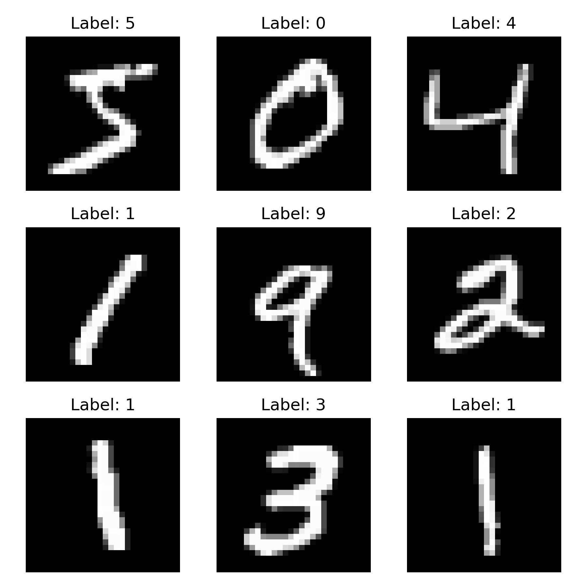
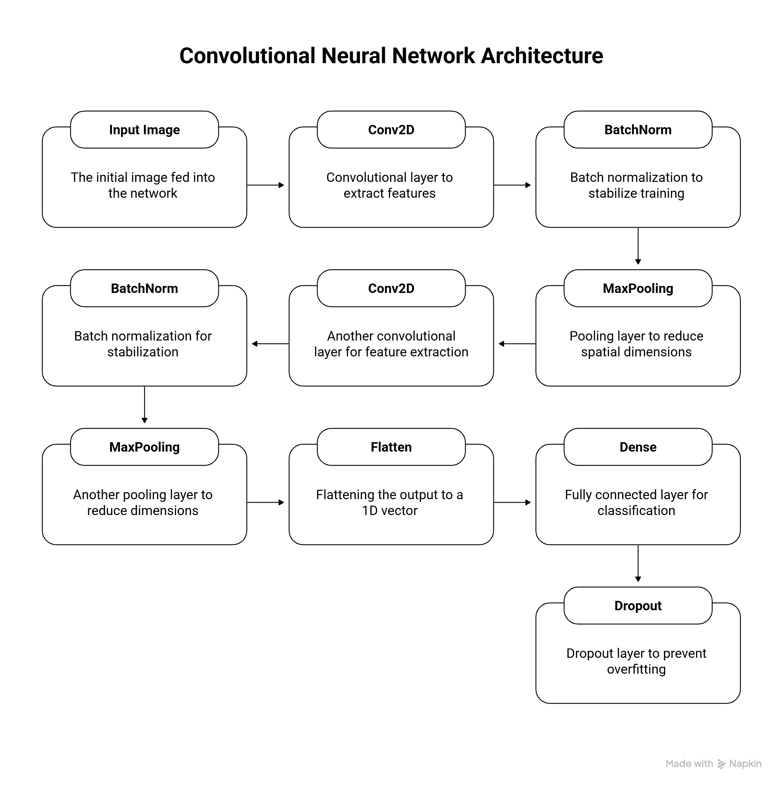
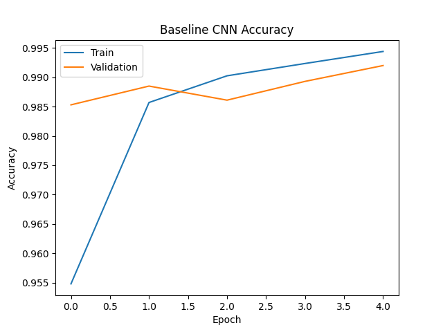
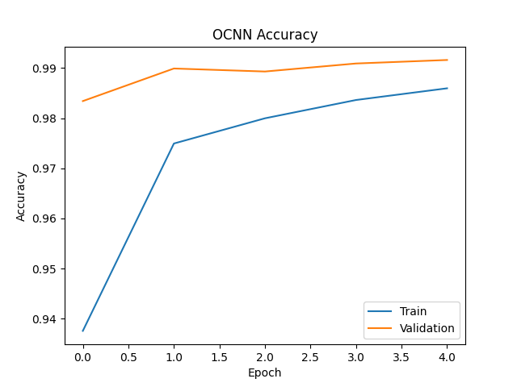
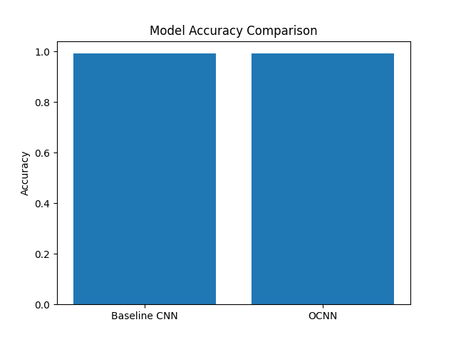
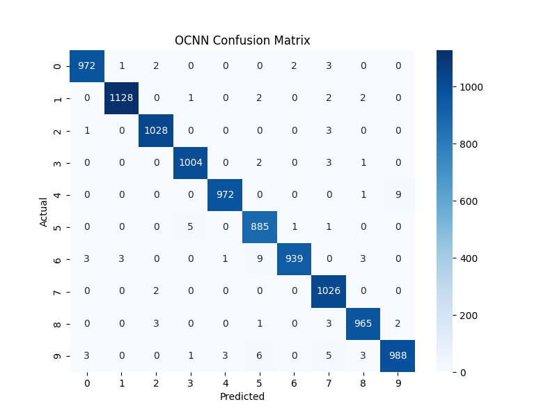
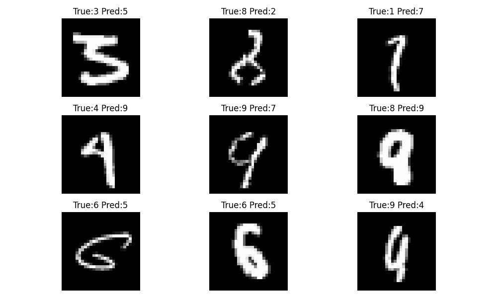
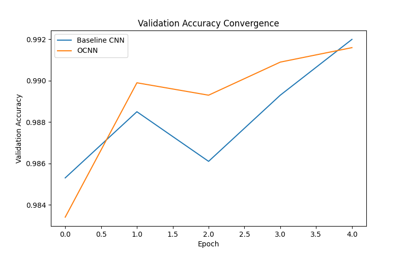

<h1 align="center">Optimized CNN (OCNN) for Handwritten Digit Recognition</h1>

Deep Learning Project using the MNIST Dataset

  
  
  

---

# Project Overview

This project implements an optimized convolutional neural network (OCNN) for handwritten digit recognition using the MNIST dataset.

A baseline CNN model was first developed and then improved by incorporating batch normalization and dropout layers. These architectural optimizations help improve training stability and reduce overfitting while maintaining high classification accuracy.

The project also includes detailed evaluation through accuracy analysis, confusion matrix visualization, convergence comparison, and error analysis.

---

# Dataset

The MNIST dataset is used for training and evaluation.

Dataset details:

- Total images: 70,000
- Training images: 60,000
- Testing images: 10,000
- Image size: 28 × 28 pixels
- Image type: Grayscale
- Classes: Digits from 0–9

  

---

# Model Architecture

The proposed Optimized Convolutional Neural Network (OCNN) improves upon a baseline CNN architecture by integrating normalization and regularization techniques.

Architecture components:

- Convolution layers for feature extraction
- Batch normalization for stable training
- Max pooling for dimensionality reduction
- Dense layers for classification
- Dropout layers to reduce overfitting
- Softmax output layer for digit prediction

  

---

# Training Results

The models were trained and evaluated on the MNIST dataset.

  

  

---

# Model Comparison

Both models achieved high classification accuracy, but the optimized architecture demonstrated improved training stability and smoother convergence.

  

---

# Confusion Matrix

The confusion matrix shows the classification performance of the OCNN model across all digit classes.

  

Most predictions fall along the diagonal, indicating correct classification of digits.

---

# Error Analysis

Misclassified samples were analyzed to understand limitations of the model. Most errors occur when handwritten digits have visually similar shapes.

  

---

# Convergence Analysis

Training convergence comparison shows that the optimized CNN achieves smoother validation accuracy across training epochs.

  

---

# Installation

Clone the repository: 

git clone https://github.com/rishitanair/OCNN-MNIST-Digit-Recognition.git

cd OCNN-MNIST-Digit-Recognition

Install required dependencies:

pip install -r requirements.txt

---

# Usage

Train baseline model:

python src/train_baseline.py

Train optimized model:

python src/train_ocnn.py

Evaluate models:

python src/evaluate_models.py

---

# Project Structure

OCNN-MNIST-Digit-Recognition
│
├── figures
│ ├── mnist_samples.png
│ ├── ocnn_architecture.png
│ ├── baseline_accuracy.png
│ ├── ocnn_accuracy.png
│ ├── model_comparison.png
│ ├── confusion_matrix_ocnn.png
│ ├── misclassified_examples.png
│ └── convergence_comparison.png
│
├── src
│ ├── data_loader.py
│ ├── train_baseline.py
│ ├── train_ocnn.py
│ ├── evaluate_models.py
│ ├── error_analysis.py
│ └── convergence_plot.py
│
├── requirements.txt
├── README.md
└── .gitignore

---

# Future Work

Potential improvements include:

- Testing on more complex datasets
- Applying data augmentation techniques
- Exploring transformer-based architectures
- Deploying the model as a web application

